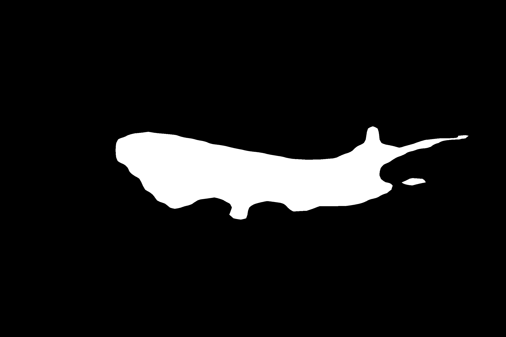

# **Poisson image blending using detectron2 image segmentation**

## **Execute**
```bash
python main.py blend --config config_file_path
```

## **Input**
Source image


Target image


## **Output**

Masked image via Detectron2



Output blended image


